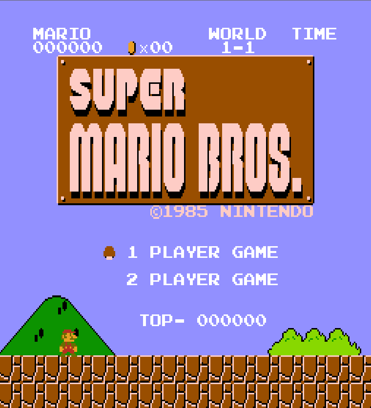
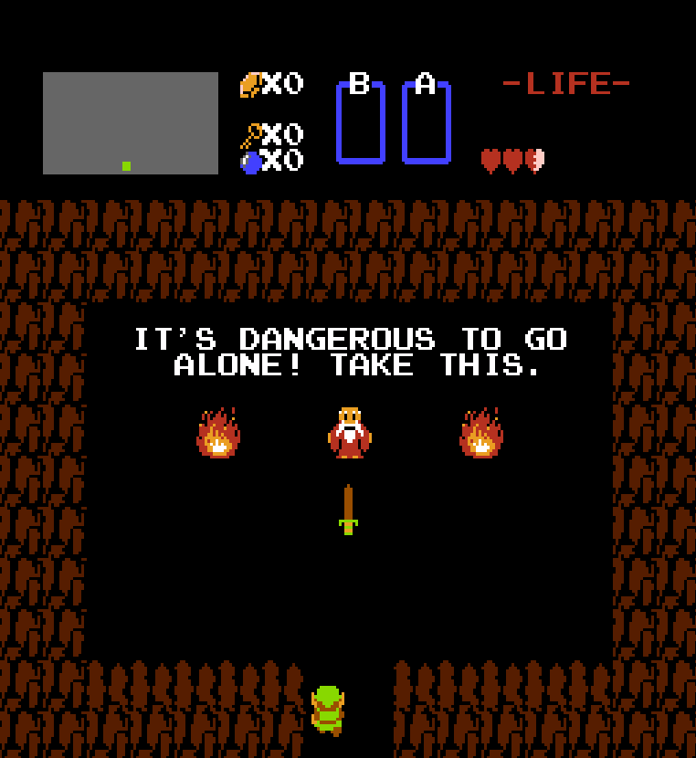

# NES Term

Terminal frontend for [SimpleNES](https://github.com/amhndu/SimpleNES) Emulator.

  

  

## Build

Relies on cmake to generate build files, `nes-term` target is created. two git
submodules are used, make sure to run `git submodule update --init` after
cloning.

Can be run by specifying the rom file as the first argument when launching from
the terminal.

## Controls

- Arrows keys
- A Button: z
- B Button: x
- Start: Enter
- Select: Backspace
